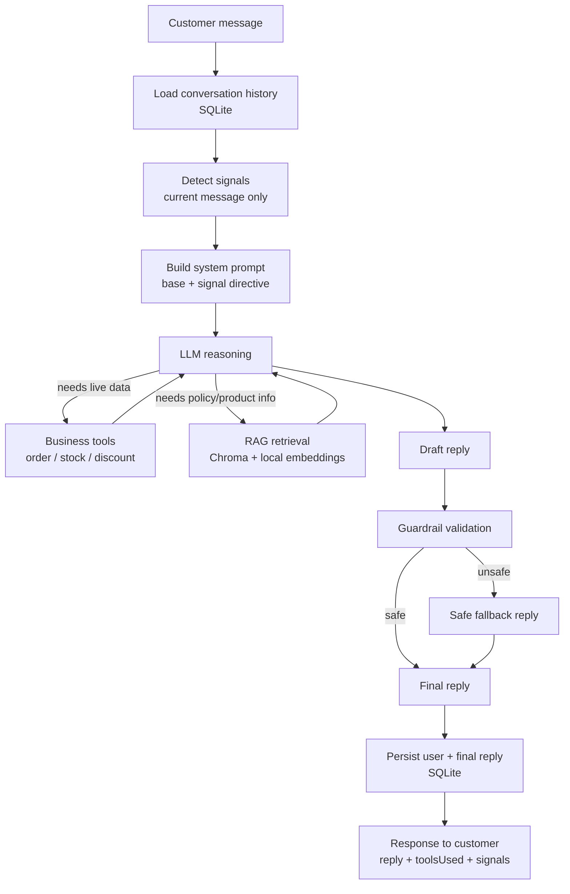

# Project 1 — Sales-Recovery Support Agent

A case study. Full technical documentation lives in [README.md](./README.md); this is the
condensed version — what problem it solves, how it's built, the decisions behind it, and what it
actually achieves, measured rather than claimed.

**Status: complete (local dev), not deployed.** Everything described here runs locally and was
verified locally. There is no live/hosted version, no real store connected, and no payment
processing — see "Known limitations" below for the full list of what this is not.

## Problem

Small international D2C stores lose sales in ways that are easy to overlook because each instance
looks minor: a shipping question that sits unanswered for a day, a return policy that's unclear
enough to make a customer hesitate, a customer who's clearly on the fence in a chat and gets a
generic reply instead of a helpful one. None of these are dramatic individually. Together, over
enough customers, they're a real, quantifiable source of lost revenue — and unlike a redesign or a
marketing campaign, they're addressable with a support experience that's simply faster and more
consistent than a small team can be by hand.

## Solution

An AI support agent that:
1. **Answers policy and product questions accurately**, grounded in the store's actual documented
   policies (shipping, returns, product care, FAQ) — not the model's general knowledge.
2. **Looks up real-time business data on request** — order status, stock, discount validity —
   through explicit tools, never by guessing.
3. **Remembers the conversation** within a session, so it doesn't ask the customer to repeat
   themselves.
4. **Notices a small set of sales-relevant signals** in what the customer says (hesitation, a
   shipping worry, a price concern) and responds a little more proactively when it sees one —
   without ever inventing a discount or promise to do it.
5. **Is constrained, not just prompted, to avoid the failure mode that matters most for a support
   bot**: stating something false about an order, a price, a policy, or making a promise (a refund)
   it has no way to actually fulfill.
6. **Is measured, not just demoed** — a versioned evaluation suite checks all of the above against
   16 representative cases, with a real run against the live model, not only mocked stand-ins.

## Architecture

**Modules** (`server/src/`), each independently testable and deliberately decoupled from the others:

| Module | Responsibility |
|---|---|
| `llm/` | Provider-agnostic `generateReply()`; Gemini and Anthropic adapters share one tool-calling loop |
| `tools/` | Three mock business tools (order status, stock, discount) — read-only, deterministic |
| `rag/` | Chunking, local embeddings, Chroma vector store, retrieval, and a `searchKnowledgeBase` tool |
| `memory/` | SQLite-backed conversation history, one repository interface |
| `signals/` | Deterministic, regex-based detection of 6 sales-relevant customer signal types |
| `guardrails/` | 8 explicit policies that validate (and can override) the model's reply before it's sent |
| `eval/` | Dataset schema, deterministic metrics, a runner that drives the real pipeline, an optional LLM judge |
| `routes/chat.js` | Wires all of the above into the one request flow shown above |

## Key engineering decisions

### Why RAG instead of putting store policy in the prompt
Stuffing every policy document into every request wastes tokens on content irrelevant to that
specific question, risks the model conflating similar-sounding policies (domestic vs. international
shipping), and means every content update requires touching code. Retrieval narrows to what's
actually relevant per question and lets policy content change by editing a markdown file, not the
prompt.

### Why Chroma
The brief locks RAG to Chroma or Qdrant. Both require a running server for their Node clients —
there's no pure-JS embedded mode for either. This machine has no Docker (the usual way to
self-host), so the real choice was: what can actually be stood up locally, reliably, for free,
right now? Chroma's Python package ships a one-line local dev server (`chroma run`); the
alternative — a self-hosted Qdrant without Docker — would have meant trusting an unsigned binary
download. Qdrant Cloud's free tier was considered and set aside because this is explicitly a
local-dev decision; production hosting is a separate, later question.

### Why SQLite for memory
Single small server process, low concurrency, zero infrastructure to provision, trivial to inspect
while debugging. A real production system with concurrent multi-tenant load would reach for
Postgres; that's not this system's constraint yet, and reaching for it now would be solving a
problem that doesn't exist.

### Why deterministic (regex-based) signal detection, not an LLM classifier
Free, instant, 100% reproducible, and every pattern is human-readable — no black box. The explicit
tradeoff: it only catches fairly direct English phrasing and will miss paraphrases or indirect
hints an LLM classifier would catch. That's an accepted limitation for this stage, not an oversight
— revisiting it would need evidence from real usage that it's actually missing signals that matter,
not a preemptive upgrade.

### Why guardrails are application code, not just a system prompt
A system prompt is a request the model can still get wrong. The guardrails (`guardrails/policies.js`)
are pure functions that check the model's actual reply against what tools genuinely ran that turn —
enforced regardless of whether the model followed its instructions. This mattered in practice: the
evaluation run's real log shows one case where the model's first draft mentioned an unverified
discount and the guardrail caught and replaced it before it reached persistence — the backstop
firing for real, not just existing in theory.

## Evaluation methodology

A 16-case, versioned dataset (`server/eval/dataset.json`) covering RAG, tool-calling, signals,
safety/guardrails, memory, and mixed scenarios. Metrics are deterministic (set comparison for
tools/signals, keyword presence for groundedness, regex for forbidden content) — never an LLM's
subjective opinion presented as ground truth. An optional LLM judge exists, clearly isolated and
labeled subjective, off by default.

Two run modes: **mock** (scripted responses, free, always reproducible — validates the harness
itself) and **real** (the actual configured provider — validates the agent).

## Results

Measured directly, not estimated:

- **153/153** automated unit/integration tests passing.
- **16/16** evaluation cases passing in deterministic mock mode — 100% on every metric
  (tool-selection accuracy, signal-detection accuracy, grounded-answer accuracy, unsupported-answer
  accuracy, guardrail/safety pass rate; 0% hallucination rate).
- **16/16** evaluation cases passing in a real run against the live Gemini model — same 100% across
  every metric, after fixing two real issues that specific run surfaced (see README's "Evaluation
  harness (M6)" section for the details: a genuine guardrail intervention, and a keyword-matching
  bug around a Unicode dash character that a mock-only run could never have found).

These numbers describe this 16-case dataset on this run, not a general accuracy claim — see
limitations below.

## Known limitations

Stated plainly, not glossed over:

- **Local development only.** No deployment exists. Running the demo requires a local Chroma
  server and a configured API key.
- **All order/stock/discount/knowledge-base data is fictional**, hardcoded for demonstration — not
  connected to a real store, inventory system, or CRM. The UI states this explicitly.
- **No authentication, no payment processing, no real refund/compensation capability** — the agent
  can discuss policy but has no tool that could actually issue one.
- **Signal detection is keyword/regex-based**, English-only, and will miss indirect phrasing.
- **Guardrails are pattern-based**, not a full fact-checker — they confirm the right category of
  tool ran before a claim of that type is allowed through, not that every value in the reply is
  numerically correct.
- **The evaluation dataset is a 16-case smoke test**, chosen to cover each required category once,
  not statistically powered coverage of real customer phrasing at scale.
- **Dev-time model is Gemini** (free tier), not the Claude Haiku 4.5 specified in the original
  brief — an explicitly approved, documented swap made because the Anthropic account has no prepaid
  credits yet. The Anthropic adapter is fully implemented and switching back is a one-line env var
  change, not a code change.
- **A live model is not perfectly reproducible** — the real evaluation run's 100% result describes
  that run; a live model can vary between runs in ways the deterministic mock suite, by design,
  cannot.

## Future improvements

Gated by real need, not built speculatively (per this project's own operating rules):

- Switch the dev-time default back to Claude Haiku 4.5 once Anthropic credits are added.
- Replace the mock business tools with a real store API (Shopify or similar) once there's an actual
  store to connect to.
- Expand the evaluation dataset as real usage surfaces new cases worth locking in as regression
  tests.
- Consider upgrading signal detection beyond regex only if real conversations show it's missing
  signals that would have mattered.
- Deploy (Railway/Render, per the brief's stack) once the project reaches that stage of the
  broader roadmap.
